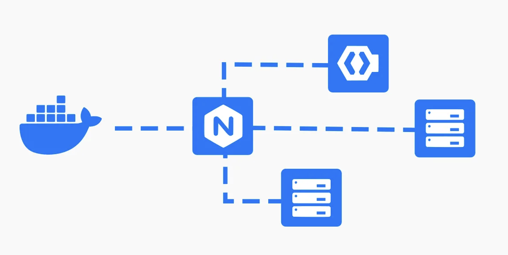

# nginx-oidc-keycloak

Пример настройки единого входа (SSO) для приложений, проксируемых за NGINX. Для этого используется механизм аутентификации OpenID Connect (OIDC), который является надстройкой над OAuth 2.0. В качестве провайдера идентификации (IdP) используется Keycloak.

## Зачем?

Если валидация токенов выполняется на уровне каждого отдельного приложения или сервиса, это приводит к дублированию кода и увеличению нагрузки на системы. При этом необходимо учитывать множество возможных ошибок и крайних случаев, что усложняет реализацию и может привести к несогласованности в работе сервисов. Это, в свою очередь, ухудшает пользовательский опыт.

## Решение

Чтобы избежать дублирования кода и связанных с этим проблем, можно использовать NGINX для проверки токенов доступа от имени бэкэнд-сервисов. Это централизует процесс проверки, упрощает обслуживание и улучшает согласованность работы системы.

Ознакомиться подробнее можно  - [lua-resty-openidc](https://github.com/zmartzone/lua-resty-openidc) и [f5.com](https://www.f5.com/company/blog/nginx/validating-oauth-2-0-access-tokens-nginx)

---

## Взаимодействие компонентов

1. **Пользователь** отправляет запрос к `nginx` на порты `8081` или `8082`.
2. **NGINX**:
   - Проверяет токен через Keycloak.
   - Если токен валиден, перенаправляет запросы к `app_one` или `app_two`.
3. **Keycloak**:
   - Выдаёт и проверяет токены.
   - Использует PostgreSQL для хранения данных пользователей и токенов.
4. **Приложения `app_one` и `app_two`** получают запросы только после успешной аутентификации через NGINX.

### Dockerfile

Dockerfile создаёт образ для OpenResty (дистрибутив NGINX, добавляющий поддержку Lua) с настройкой для работы с OIDC (OpenID Connect).

### Файл Docker compose

Описывает сервисы, взаимодействующих друг с другом:

1. **`postgres`**: 
   - Контейнер с PostgreSQL, который используется Keycloak для хранения данных.
   - Настройки базы данных (через **env** `POSTGRES_DB`, `POSTGRES_USER`, `POSTGRES_PASSWORD`).

2. **`keycloak`**:
   - Контейнер с Keycloak, настроенный на использование Postgre.
   - Работает как IdP (Identity Provider) для OIDC.
   - Запускается в dev-режиме и подключается к базе данных.

3. **`app_one`** и **`app_two`**:
   - Два приложения на основе NGINX, подключенные к общей сети.

4. **`nginx`**:
   - Основной прокси-сервер на базе OpenResty.
   - Построен из Dockerfile.
   - Подключён конфигурационный файл (`nginx.conf`) как volume.

5. **Сеть**:
   - Все сервисы соединены в одну сеть `network`.

### Конфиг nginx

Файл конфигурации описывает два виртуальных сервера, работающих на разных портах (8081 и 8082), каждый из которых проксирует запросы к приложениям (app_one и app_two).

- **`access_by_lua`**
    - Проверка JWT токена через `lua-resty-openidc`.
    - Настройки подключения к Keycloak (адрес `discovery`, `client_id`, `client_secret`, `redirect_uri` и пр.).
    - В случае ошибки аутентификации возвращается статус 403.
- **`app_one`** и **`app_two`**:
    - Два приложения на основе NGINX.
    - Имитация работы 2 сервисов.

### Настройка Keycloak

После запуска контейнера Keycloak можно получить доступ к административной панели по адресу [http://localhost:3333](http://localhost:3333). Настройка включает создание нового *realm*, клиентов, добавление пользователей и конфигурацию URI для перенаправлений.

### 1. Создание нового *realm*

*Realm* - изолированное пространство для управления пользователями, ролями и клиентами.

1. Входим в админ-панель Keycloak, используя учетные данные администратора (`KC_BOOTSTRAP_ADMIN_USERNAME`).
2. Переходим в раздел **Realm Settings** - **Create**.
3. Указываем имя нового *realm* (например, `newrealm`) и сохраняем.

#### 2. Добавление *clients*

Clients по сути приложения или сервисы, которые будут взаимодействовать с Keycloak:

1. Переходим в раздел **Clients** и нажмите **Create**.
2. Указываем:
   - **Client ID** (например, `nginx_client_one` или `nginx_client_two`).
   - **Client Protocol** — `openid-connect`.
   - **Root URL** (например, `http://localhost:8081` для первого клиента и `http://localhost:8082` для второго).
3. После создания клиента находим в его настройках и добавляем:
   - **Valid Redirect URIs** (например, `http://localhost:8081/*`).
   - Сохраняем.

#### 3. Получение *Client Secret*

*Client Secret* используется для аутентификации клиентов:

1. В разделе настроек Client ищем вкладку **Credentials**.
2. Копируем значение *Client Secret* и добавляем его в файл конфигурации `nginx.conf` (параметр `client_secret = "secret_insert"`).

#### 4. Добавление пользователей

Пользователи — это конечные участники, которые будут аутентифицироваться через Keycloak:

1. Переходим в раздел **Users** - **Add User**.
2. Указываем:
   - **Username**.
   - **Email**, **First Name**, **Last Name** (по желанию).
3. Сохраняем.
4. Переходим в раздел настроек пользователя на вкладку **Credentials**.
5. Указываем новый пароль и ставим флаг **Temporary** в `OFF`, чтобы пароль стал постоянным.
6. Жмем **Set Password**.

После завершения настройки Keycloak можно протестировать авторизацию с использованием созданных клиентов и пользователей. Прокси-сервер NGINX будет использовать указанные параметры (*Client Secret*, *Redirect URIs*, *Discovery URL*) для работы с OIDC.
